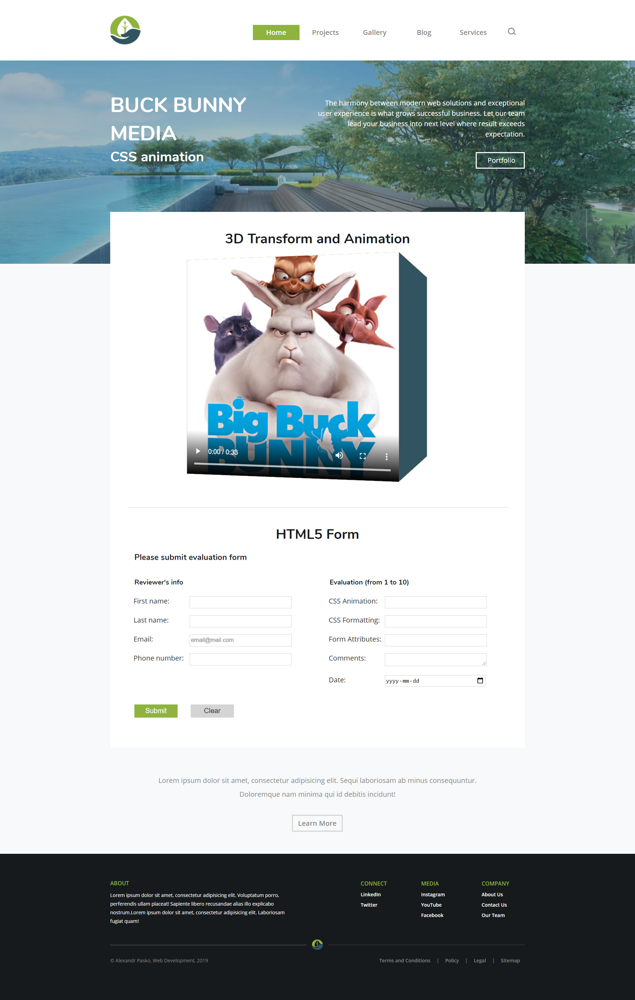

# Media Cube

[Link to Demo](http://cube.alexandrpasko.com/)

The project is a single web page with 3D CSS animation integrated in it. Layout and design of the page is created according to CRAP design principles – contrast, repetition, aligning and proximity. The body of the web page contains a 3D cube rotating, with a video clip on one of the cube sides, which makes the web page seem fascinatingly. 

## Technologies/Languages:
* HTML
* CSS
* Video
* 3D animation

## Screenshot:
